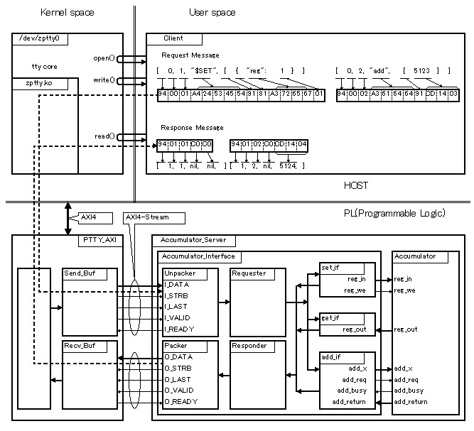

# MessagePack-RPC for VHDL


## Overview


MessagePack-RPC for VHDL は、従来の伝統的なレジスタアクセスによるFPGA/ASIC の制御に替えて、MessagePack-RPC による FPGA/ASIC の制御を試みたものです。その目的は、ユーザー空間のアプリケーションと FPGA が直接 MessagePack-RPC プロトコルでやり取りすることにより、デバイスドライバの開発とメンテナンスを簡略化することと、スクリプト言語など直接メモリをアクセスできない環境でFPGAの制御を可能にすることです。

下図に MessagePack-RPC を使った例を示します。図の上半分がホスト(CPU)上で動作するソフトウェアで、下半分がFPGA(Programmable Logic)上に構築した論理回路です。


Fig.1 MessagaPack-RPC Example Block Diagram

<br />


## Introduction


### レジスタアクセス方式の問題点


従来の伝統的なハードウェアを制御する方法は、レジスタアクセス方式によるものです。これはハードウェアとホスト(CPU)とをバス(AXIやPCIeなど)で接続し、ホスト(CPU)がハードウェア上に実装したレジスタにリード/ライトすることでハードウェアの制御を行う方式です。

長らく使われてきたレジスタアクセス方式ですが、私は次のような問題があると考えています。

* 直接メモリ(またはI/O)空間にアクセスしなければならない
* 低速かつ一体不可分な、リード/ライト・トランザクション
* BigEndian/Little Endian のような、ハードウェア依存性
* 分かりにくて拡張性に乏しい、アドレスとビットフィールドによるレジスタの指定


#### ・直接メモリ(またはI/O)空間にアクセスしなければならない


ハードウェアはバス(AXIやPCIeなど)を介してホスト(CPU)に接続されています。ホスト(CPU)がバスを介してハードウェアにアクセスするためには、通常、ホスト(CPU)の持つメモリアクセス命令(CPUによってはI/Oアクセス命令)を使います。しかしこれらの命令はアセンブラなどの直接CPUの命令を使える言語か、あるいはCのような低レベルの言語でなければ使うことが出来ません。例えば Java やRuby などの高級言語からは直接アクセスすることは出来ません(一部例外な言語はあります)。そのような言語でアクセスするためには、間にCやアセンブラで記述したライブラリかデバイスドライバが必要になります。


#### ・低速かつ一体不可分な、リード/ライト・トランザクション


ホスト(CPU)がバスを介してハードウェアのレジスタにアクセスする際は、一般的にバスの持つリード/ライト・トランザクション・プロトコルを使います。ここでトランザクションと言っているのは、ホスト(CPU)がリードまたはライトの要求を出して、ハードウェアがその要求に対する応答を返すという一連の動作が一体不可分(要求と応答が分離できない)だからです。

例えば、ホスト(CPU)がハードウェアに対してリードアクセスしたとします。CPUはバスに対してリード要求をします。バスはハードウェアに対してリード要求をします。ハードウェアはバスに対してリードの結果を返します。バスはCPUに対してその結果を返します。これがリード・トランザクションです。

同様に、ホスト(CPU)がハードウェアにライトアクセスしたとします。CPUはバスに対してライトデータと供にライト要求をします。バスはハードウェアに対してライト要求をします。ハードウェアはバスに対してライトの結果(成功or失敗)を返します。バスはCPUに対してその結果を返します。これがライト・トランザクションです。

では、これらトランザクションの間、CPUは何をやっているかというと、実は何もしていません。というより何も出来ません。ひたすら応答が返ってくるのを待っています。

通常、CPUがメインメモリに対してリード/ライトする場合は、間にデータキャッシュが介在していて、この待ち時間を隠蔽しています。しかし、ハードウェアのレジスタに対するアクセスの場合はキャッシュを無効にするので、バカにならないくらいの待ち時間が発生します。

さらに低速なだけではなく、例えばハードウェアにバグがあったりしてハードウェアが応答しなかった場合、CPUはひたすら応答を待ち続けます。こうなるとシステムがフリーズ状態になります。ちなみに割り込みも効かなくなります。もともと割り込みというのは実行が完了した命令と次の命令の間に割り込む機構なので、命令自体が完了しない場合はまったくの無力です。

CPUが応答待ちから回復するにはCPUにリセットをかけるしかありません。リセットをかけるには、マルチコアにして別のCPUからかけるか、ウォッチドッグタイマなどの機構が必要です。

このように、トランザクションによるレジスタアクセスには、アクセス回数をなるべく必要最小限にする、エラーやシステムダウンに対処するなどの、細心の注意が必要です。


#### ・BigEndian/Little Endian のような、ハードウェア依存性


CPUのアーキテクチャには Big Endian と Little Endian があります。Big Endian と Little Endian の違いに関してはここでは説明しませんが、ハードウェアのレジスタアクセスする際にはちょっと厄介です。さらに厄介なことに、CPUだけでなくバスにもハードウェアのレジスタにも Big Endian と Little Endian があって、これらの組み合わせも考慮しなければなりません。


#### ・分かりにくて拡張性に乏しい、アドレスとビットフィールドによるレジスタの指定


ハードウェアのレジスタには各々にアドレスが割り当てられています。ホスト(CPU)がレジスタにアクセスする際には、この割り当てられたアドレスを指定します。また、一つのレジスタに複数の機能がビットフィールドを分けて割り当てられていることも多々あります(特にメモリ空間が貴重なリソースだった昔)。

ホスト(CPU)がハードウェアを制御する際は、これらのアドレスとビットフィールドを知らなければなりません。これらのアドレスとビットフィールド情報は、ハードウェアのデータシートという形でソフトウェアエンジニアに提示されます。で、まあ大抵このデータシートっていうのがソフトウェアエンジニアには、分かりにくい、間違いが多いとかでたいへん不評だったりします。

また、一つのレジスタに複数の機能がビットフィールドを分けて割り当てられていた場合、それらのビットフィールドにアクセスする際はビット演算が必要になります。例えば、あるレジスタのあるビットフィールドだけを書き換えたい場合、一度そのレジスタを全部リードして、そのビットフィールドだけをビット演算を駆使して変更して、再度レジスタに書き戻すなどの面倒な処理が必要な場合もあります。

さらに、一度アドレスを割り当ててしまうと、容易に変更することはできません。例えば、あるレジスタを32ビットで定義していたのをハードウェアの修正/更新で64ビットにする場合、上位32ビットのレジスタを下位32ビットのレジスタと離れたアドレスに割り振るとか、全レジスタのアドレスの割り振りを最初からやり直すとかが必要になる場合があります。


### デバイスドライバによる解決方法とその問題点


前節で説明した、レジスタアクセス方式の問題点は、個々の問題に関しては比較的簡単に解決できます。いずれの場合もホスト(CPU)で動作するソフトウェアを注意深く設計することです。そして、ホストに汎用OSを使う場合、これらの制御を行うソフトウェアがデバイスドライバです。

デバイスドライバによる解決方法の問題点は、デバイスドライバがハードウェアとソフトウェア(ユーザーアプリケーション)とOSとの狭間(死角)にあるため、どの担当エンジニアからも遠い(守備範囲外)と思われてしまい、管理がおろそかになることが多いことです。デバイスドライバ専門のエンジニアがいる場合は良いのですが、何故かいなかったり、別の仕事と兼任してたり、充分なリソースが割り当てられてなかったりすることがよくあります(デバイスドライバの設計や管理はハードウェア、ソフトウェア、OSの３者の知識が必要なため、むしろ敷居は高かったりするのですが)。

また、デバイスドライバは、ハードウェア、ソフトウェア(ユーザーアプリケーション)、OSの仲立ちをする関係上、これら３者の変更/修正/更新の影響をもろに受けます。従って、デバイスドライバは常にメンテナンスが必要です。例えば、せっかく作ったハードウェアとアプリケーションが、OSのバージョンアップについていけずに何時までも古いOSでしか動かないなんて事態も起こります。


### MessagePack-RPC による解決方法


レジスタアクセス方式の問題点をデバイスドライバという場所に一か所に集めて集中管理/対処するという考え方はあながち間違ってはいません。しかし各々の問題点そのものを無くしてしまうという考え方もあります。そうして試験的に実装してみたのが MessagePack-RPC によるハードウェアの制御です。


#### MessagePackとは


[MessagePack](http://msgpack.org/)は次のような特徴を持つデータ表現形式です。

*  高速なシリアライズ/デシリアライズ
* コンパクトなデータ表現
* 特定の言語に依存しない
* 特定のコンピューターアーキテクチャに依存しない
* 配列と辞書(Key-Value-Store)に対応している


#### MessagePack-RPCとは


[MessagePack-RPC](https://github.com/msgpack-rpc/msgpack-rpc)は、上のようなMessagePackの特徴をいかして、特定の言語、OS、CPUに依存せずに、サーバーとクライアント間でRemote Procedure Callを行うプロトコルです。

例えば、リモートプロシージャーコールのリクエストは次のようなMessagePack形式です。


```Shell
[type, msgid, method, params]
```


リクエストの場合、typeは0です。msgidは32ビットの符号無し整数、method はメソッド名を"文字列"で指定します。params はメソッドに渡す引数を配列で指定します。つまりレジスタアクセスの時のようなアドレスやビットフィールドの指定は必要ありません。


リクエストに対するレスポンスは次のような MessagePack形式です。


```Shell
[type, msgid, error, result]
```


レスポンスの場合、typeは1です。msgid はリクエストで指定した数字が入っています。error は、もしエラーが発生した場合は、なんらかの値が入ります。成功した場合は nil が入ります。result は Remote Procedure Call の戻り値です。


MessagePack-RPCは、リクエストとレスポンスが分離していて、同時に複数のリクエストを出したり、応答がない場合はタイムアクト処理をすることが可能です。

また、JavaやRuby などのスクリプト言語でも MessagePack-RPC をサポートしているものは多くあるので、それらの言語からハードウェアを制御することができます。


#### MessagePack-VHDLとは


[MessagePack-VHDL(https://github.com/ikwzm/msgpack-vhdl)](https://github.com/ikwzm/msgpack-vhdl)は、MessagePackをFPGAやASICで扱うためのライブラリです。当然、論理合成が可能です。

このライブラリを使って、FPGA上に MessagePack-RPC のサーバー機能を実装してみました。こうすることで、FPGAで実装した各種機能をホストコンピューターから言語やCPUに依存しない形で利用することが出来ます。


#### MessagePack-RPC におけるデバイスドライバの役割


MessagePack-RPC によるハードウェア制御の場合も、汎用OSで使う時にはデバイスドライバが必要です。しかし、MessagePack-RPC のデバイスドライバは、メッセージの中身には関知しません。あくまでもメッセージのパイプ役(メッセンジャー)に徹します。したがってデバイスドライバはハードウェアやユーザーアプリケーションには依存せず、メンテナンスが容易になります。


## Architecture


ここではアーキテクチャを、次のようなJavaで記述しSynthesijer で高位合成したモジュールを MessagePack-RPC で制御する例で示します


```Java:Accumulator.java
public class Accumulator {
    public int reg;
    public int add(int x) {
        reg = reg + x;
        return reg;
    }
}
```


### Block Diagram




Fig.2 MessagaPack-RPC Example Block Diagram

<br />


### Accumulator_Server


Accumulator_Server はJavaで記述しSynthesijerで高位合成した Accumulatorと、MsgPack-RPC-VHDLを使って構築したAccumulator_Interfaceの二つで構成されます。


#### Accumulator


```Java:Accumulator.java
public class Accumulator {
    public int reg;
    public int add(int x) {
        reg = reg + x;
        return reg;
    }
}
```


上のJavaコードをSynthesijerで高位合成したものです。Synthesijer によって、次のようなentityを持つVHDLファイルが生成されます。


```VHDL:Accumulator.vhd
entity Accumulator is
  port (
    clk : in std_logic;
    reset : in std_logic;
    reg_in : in signed(32-1 downto 0);
    reg_we : in std_logic;
    reg_out : out signed(32-1 downto 0);
    add_x : in signed(32-1 downto 0);
    add_return : out signed(32-1 downto 0);
    add_busy : out std_logic;
    add_req : in std_logic
  );
end Accumulator;
```


#### Unpacker


シリアライズされたMessagePack-RPCのリクエストメッセージを AXI4-Streamインターフェースから受け取って内部形式に変換します。


#### Requester


メソッド名を解析して該当するメソッドインターフェース(add_if、set_if、get_if)にmsgidとparamを渡します。


#### Responder


メソッドインターフェース(add_if、set_if、get_if)からのレスポンス出力要求を調停して、レスポンスメッセージを構築します。


#### Packer


レスポンスメッセージをMessagePack形式にシリアライズして AXI4-Streamインターフェースから出力します。


#### set_if


public宣言された変数(reg)に値を設定するモジュールです。次のようなMessagePack-RPC リクエストを受け付けます。


```Shell
[0, msgid, "$SET", [{"reg": value}]]
```


メソッド名は"\$SET"です。頭に\$がついているのは、単にJavaのメソッドと名前がかぶらなようにするためです。

パラメータは変数名と設定する値が対になっているmapを指定します。この例では変数名に"reg"、値(value)は整数を指定します。成功すれば次のようなレスポンスが返ってきます。


```Shell
[1, msgid, nil, nil]
```


#### get_if


public宣言された変数(reg)から値を読むモジュールです。次のようなMessagePack-RPC リクエストを受け付けます。


```Shell
[0, msgid, "$GET", [{"reg": nil}]]
```


メソッド名は"\$GET"です。頭に\$がついているのは、単にJavaのメソッドと名前がかぶらなようにするためです。

パラメータは読み出したい変数の名前と読み出す数またはnilが対になっているmapを指定します。この例では変数名に"reg"、値はnilを指定します。

成功すれば次のように、読み出した変数の名前と読み出した値(value)が対になったmapが返ってきます。


```Shell
[1, msgid, nil, [{"reg": value}]]
```


#### add_if


addメソッドを呼び出すモジュールです。次のようなMessagePack-RPCリクエストを受け付けます。


```Shell
[0, msgid, "add", [value]]
```


valueにはaddメソッドに渡す引数を指定します。成功すれば次のように、addメソッドの戻り値が返ってきます。


```Shell
[1, msgid, nil, result]
```


add_ifはAccumulator に対して引数をadd_xに出力し、リクエスト信号(add_req)を'1'にします。

Accumulatorはリクエスト信号(add_req)に対してビジー信号(add_busy)に'1'を出力して、処理が終わるとビジー信号に'0'を出力して結果をadd_return に出力します。

add_if はaccumulator からの結果(add_return)を内部形式に変換してmsgidと一緒にResponderに渡します。


### PTTY_AXI


PTTY_AXI はAXI4-Streamの入出力インターフェースをホストからはシリアルインターフェースとして見せるためのIPです。

* ホストとのインターフェースはAXI4です。
* Accumulator_ServerとのインターフェースはAXI4-Streamです。
* 送信と受信に各々128バイトのバッファを持っています。


### /dev/zptty


/dev/zpttyはPTTY_AXIを介してAccumulator_Serverの入出力をあたかもシリアルポートに見せるためのデバイスドライバです。このドライバを使うことにより、Accumulator_ServerとのMessagePack-RPCのやりとりはシリアルポートを介して行うように見えます。

/dev/zpttyは、Linux標準のttyコア部と、PTTY_AXI固有のドライバ部zptty.koで構成されます。


### Client


Linuxのユーザー空間で動作するクライアントプログラムです。このクライアントプログラムがMessagePack-RPCのリクエストメッセージを作成し/dev/zpttyを介してAccumulator_Serverに送信します。そしてAccumulator_ServerからのMessagePack-RPCのレスポンスメッセージを/dev/zpttyを介して受信します。


## Licensing


Distributed under the BSD 2-Clause License.


## References


MessagePack (http://msgpack.org/)

MessagePack-RPC (https://github.com/msgpack-rpc/msgpack-rpc)

MessagePack for VHDL (https://github.com/ikwzm/msgpack-vhdl)

